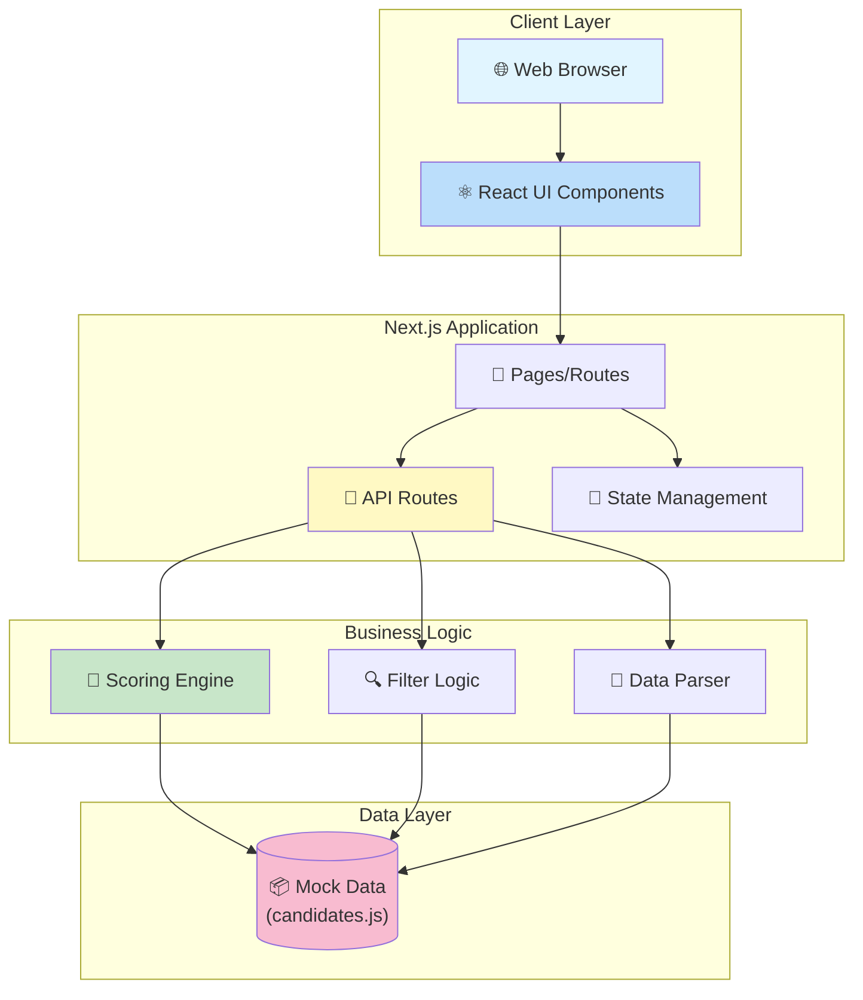
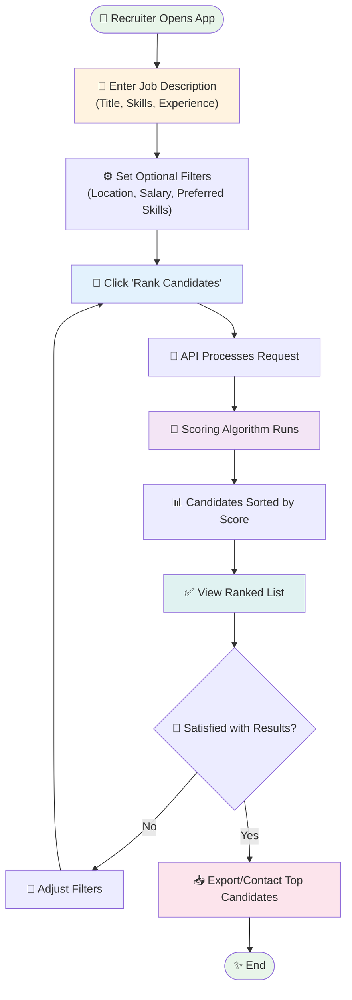
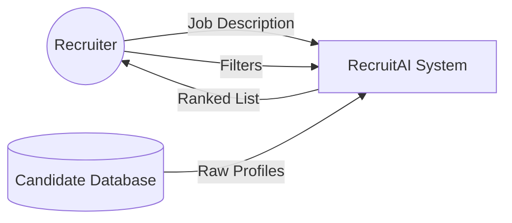
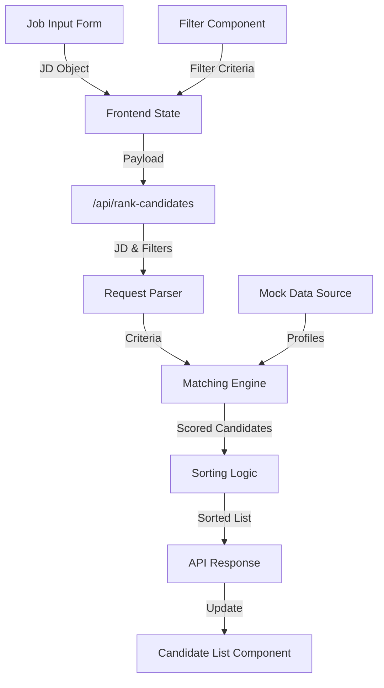
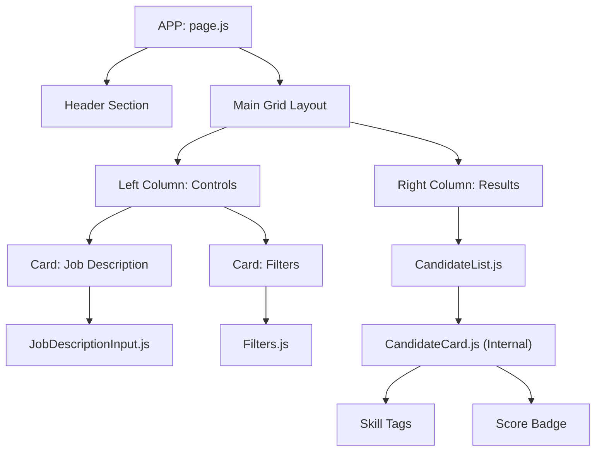
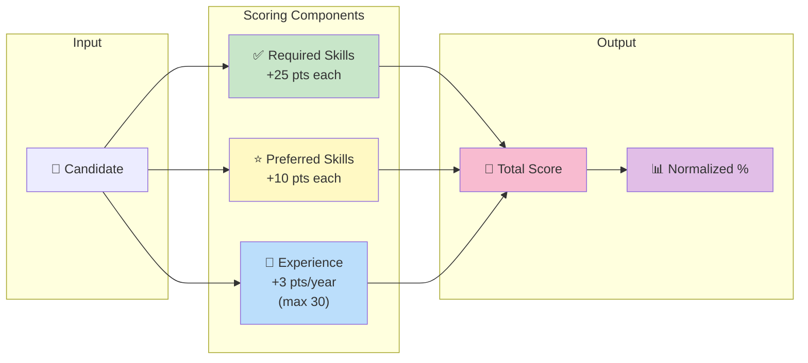
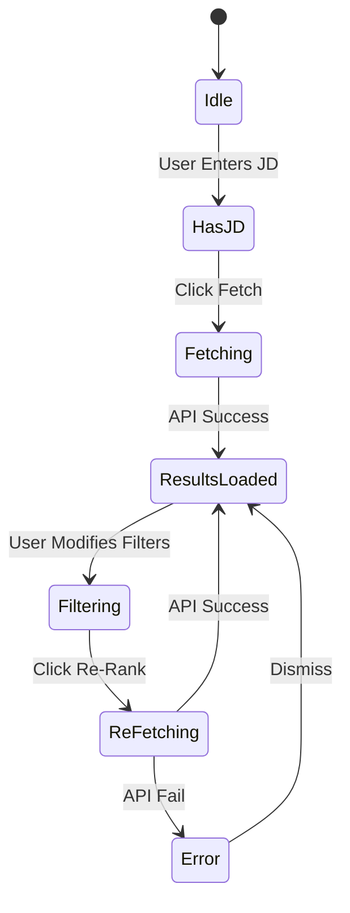
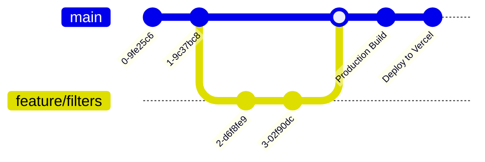
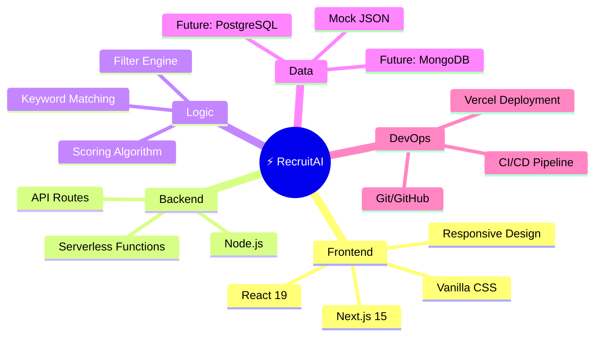

# RecruitAI - Intelligent Candidate Ranking System

RecruitAI is a cutting-edge **Applicant Tracking & Ranking System (ATS)** built with **Next.js**. It streamlines the recruitment process by intelligently matching candidate profiles against job descriptions using weighted scoring algorithms.

Features include **real-time filtering**, **resume parsing simulation**, **smart candidate scoring**, and a **responsive, modern UI**.

---

## 🎯 System Overview

**RecruitAI** addresses the core challenge of modern recruitment: **Information Overload**. With hundreds of applicants for a single position, recruiters struggle to identify top talent efficiently.

This project delivers a **automated, intelligent ranking engine** that serves as a first-pass filter, ensuring that recruiters can focus their energy on the most promising candidates. Unlike traditional keyword matching, RecruitAI uses a **weighted multi-criteria scoring model** that balances hard skills, soft skills (preferred), and experience.

---

## 🎯 Problem vs. Solution

| The Problem 🛑 | The RecruitAI Solution ✅ |
| :--- | :--- |
| **Manual Screening Fatigue**: Reviewing hundreds of resumes manually leads to errors and burnout. | **Automated Scoring**: Instantly processes and ranks candidates based on objective criteria. |
| **Keyword Bias**: Simple "Ctrl+F" misses qualified candidates who might lack one specific term. | **Weighted Algorithms**: nuanced scoring considers "Preferred" vs "Required" skills differently. |
| **Unresponsive Interfaces**: Clunky, legacy ATS software slows down workflows. | **Modern React UI**: A fast, responsive, and intuitive dashboard built with Next.js 15. |

---

---

## 📚 Table of Contents
1. [Software Architecture](#-software-architecture)
2. [User Flow Journey](#-user-flow-journey)
3. [Data Flow Diagrams](#-data-flow-diagrams)
4. [Component Hierarchy](#-component-hierarchy)
5. [API Workflow (Sequence Diagrams)](#-api-workflow)
6. [Scoring Algorithm Viz](#-scoring-algorithm)
7. [State Management](#-state-management)
8. [Folder Structure](#-folder-structure)
9. [Deployment Pipeline](#-deployment-pipeline)
10. [Technology Stack](#-technology-stack)
---

## 🏛 Software Architecture

High-level overview of the application's architecture, following a standard Client-Server model within the Next.js framework.



---

## 🚀 User Flow Journey

The step-by-step journey of a recruiter using the application.



---

## 🔄 Data Flow Diagrams

### Level 0: Context Diagram



### Level 1: Detailed Data Flow



---

## 🧩 Component Hierarchy

Visualizing the React Component tree structure.



---

## 📡 API Reference

### `POST /api/rank-candidates`

Core endpoint that handles candidate scoring and ranking.

#### Request Body
| Field | Type | Description |
| :--- | :--- | :--- |
| `jobDescription` | `Object` | **Required**. Contains job criteria. |
| `jobDescription.skills` | `String` | Comma-separated required skills (e.g. "React, Node"). |
| `jobDescription.experience` | `Number` | Minimum years of experience required. |
| `filters` | `Object` | **Optional**. Additional refinement criteria. |
| `filters.preferredSkills` | `String` | Comma-separated nice-to-have skills (+5 points). |
| `filters.location` | `String` | Filter candidates by city/state. |

#### Example Request
```json
{
  "jobDescription": {
    "title": "Frontend Developer",
    "skills": "React, JavaScript, CSS",
    "experience": 2
  },
  "filters": {
    "preferredSkills": "TypeScript, Redux",
    "minExperience": 3,
    "location": "Remote"
  }
}
```

#### Example Response (Success 200)
```json
[
  {
    "id": 101,
    "name": "Jane Doe",
    "score": 35,
    "matchDetails": {
      "requiredMatches": ["React", "JavaScript"],
      "preferredMatches": ["TypeScript"],
      "experienceMatch": true
    }
  },
  // ... more candidates
]
```

#### Error Codes
-   **400 Bad Request**: Missing `jobDescription` or invalid payload.
-   **405 Method Not Allowed**: If request method is not POST.
-   **500 Internal Server Error**: Server-side processing failure.

---

## 🧮 Scoring & Filtering Logic (Deep Dive)

The system employs a **Two-Phase Ranking Process** to ensure quality matches.

### Phase 1: Hard Filtering (Exclusion)
Before scoring, candidates are strictly filtered out if they fail to meet non-negotiable criteria. This optimizes performance by reducing the set of candidates to rank.

| Criteria | Logic |
| :--- | :--- |
| **Minimum Experience** | Candidates with experience `<` the required years are removed. |
| **Location Restriction** | If a location is set, candidates not matching the string are excluded. |
| **Salary Budget** | Candidates whose `salaryExpectation` exceeds `salaryMax` are filtered out. |
| **Mandatory Skills** | "Exclusion Filter" allows recruiters to strictly require specific tags. |

### Phase 2: Weighted Scoring (Ranking)
Candidates who pass Phase 1 are assigned a dynamic score based on the following weights:

1.  **Required Skills Match (`+25 points` per skill)**
    -   High impact. Matches against the core skills defined in the Job Description.
    -   *Logic*: `if (candidate.skills.includes(reqSkill)) score += 25`

2.  **Preferred Skills Match (`+10 points` per skill)**
    -   Medium impact. Bonus points for "Nice-to-have" skills (e.g., TypeScript, AWS).
    -   *Logic*: `if (candidate.skills.includes(prefSkill)) score += 10`

3.  **Experience Bonus (`+3 points` per year)**
    -   Rewards seniority. Capped at 30 points (10 years) to prevent experience from outweighing skill matches.
    -   *Logic*: `score += Math.min(candidate.experience * 3, 30)`

4.  **Normalization**
    -   Final scores are normalized relative to the highest-scoring candidate to produce a `0-100%` match percentage.



---

## 💾 State Management

Frontend State Machine representation (React Hooks).



---

## 📂 Folder Structure

```text
candidate-ranking-system/
├── app/                  # Main Application Source
│   ├── components/       # Reusable UI Components
│   │   ├── CandidateList.js
│   │   ├── Filters.js
│   │   └── JobDescriptionInput.js
│   ├── data/             # Mock Data
│   ├── globals.css       # Global Styles
│   ├── layout.js         # Root Layout
│   └── page.js           # Main Page (Dashboard)
├── pages/
│   └── api/              # Serverless API Routes
│       └── rank-candidates.js  # Scoring Logic Endpoint
├── public/               # Static Assets
└── package.json          # Project Dependencies
```

---

## 🚢 Deployment Pipeline

CI/CD Flow using Vercel.



---

## 🛠 Technology Stack



### Core Technologies
-   **Frontend**: Next.js 15, React 19, Vanilla CSS (Custom Design System).
-   **Backend**: Node.js (Next.js API Routes).
-   **AI/Logic**: Keyword Matching Algorithm, Weighted Scoring System.

### Key Features (Project Details)
1.  **Smart Keyword Extraction**: Automatically identifies required skills from job descriptions.
2.  **Weighted Scoring System**:
    -   *Required Skills*: High priority (+10 points).
    -   *Preferred Skills*: Medium priority (+5 points).
    -   *Experience Match*: Bonus points (+2 per year).
3.  **Real-Time Filtering**: Instant feedback on candidate matches.
4.  **Responsive Design**: Mobile-friendly UI with smooth animations.
5.  **Secure API Basic**: Input validation and sanitized payloads.

---

## 🔮 Future Roadmap

To further enhance RecruitAI, the following features are planned for future releases:

-   [ ] **LLM Integration**: Use OpenAI/Gemini API to parse raw PDF resumes and extract skills semantically rather than just keyword matching.
-   [ ] **Auth & Roles**: Implement NextAuth.js for multi-user support (Recruiters vs. Admins).
-   [ ] **Database Integration**: Migrate from mock JSON data to a production-ready PostgreSQL (Supabase) or MongoDB database.
-   [ ] **Email Notifications**: Automated email alerts to candidates upon shortlisting.

---

---

## 🚀 Getting Started

### Prerequisites
- Node.js 18+
- npm / yarn

### Installation
1. Clone the repo:
   ```bash
   git clone https://github.com/your-username/candidate-ranking-system.git
   ```
2. Install dependencies:
   ```bash
   npm install
   ```
3. Run Development Server:
   ```bash
   npm run dev
   ```
### 4. Build for Production:
   ```bash
   npm run build
   ```

### 5. Customization & Configuration

You can tweak the scoring logic in `pages/api/rank-candidates.js`.

**Adjusting Weights:**
```javascript
// Example: prioritize experience over skills
const SCORES = {
    REQUIRED_SKILL: 25, // Change to 20?
    PREFERRED_SKILL: 10,
    EXPERIENCE_PER_YEAR: 3 // Change to 5?
};
```

---

## 🔧 Troubleshooting

| Issue | Possible Cause | Solution |
| :--- | :--- | :--- |
| **No Candidates Found** | Mock data mismatch. | Ensure `data/candidates.json` has users matching your specific JD skills. |
| **API Error 500** | Invalid JSON payload. | Check browser console network request. Ensure `jobDescription` object is valid. |
| **Images not loading** | Local path issue. | Ensure images are in `public/assets` or correctly referenced in the `next.config.js`. |

<<<<<<< HEAD


=======
---
>>>>>>> eb471d1768cdee7629fa4e12825ef7af7f8e0436
